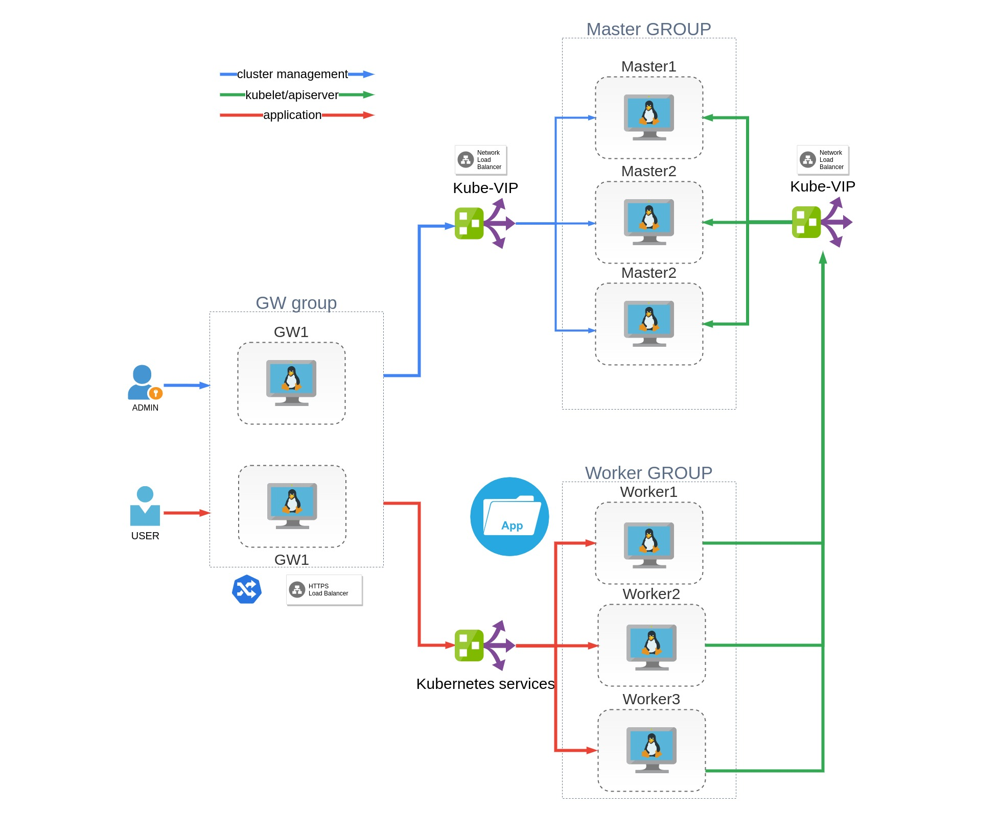
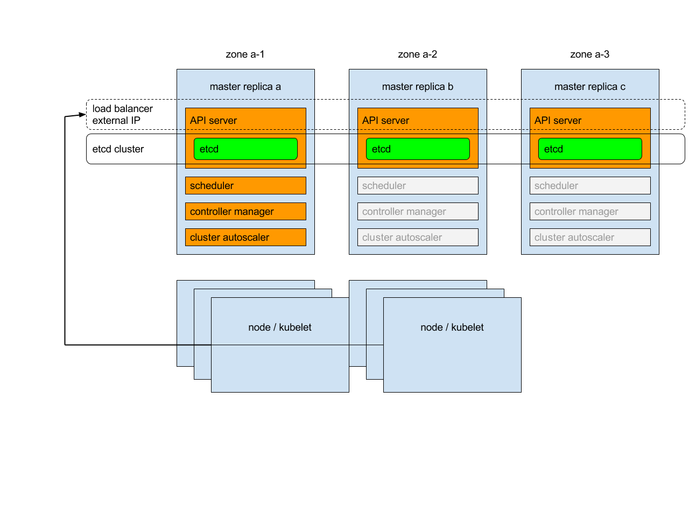
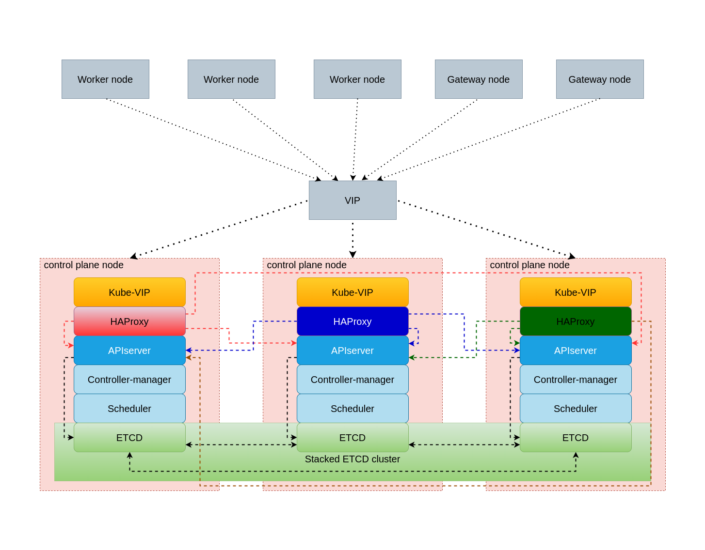

# Deploy HA k8s cluster with kubeadmin using ansible and vagrant

## Introduction

Deploy HA kubernetes cluster with 3 contol-plane nodes, 3 worker nodes and 2 GW nodes for external access to cluster using Vagrant

:warning: **This version work only with Ubuntu Server**

## Contents

1. [Requirements](#requirements)
   * [Host](#host)
   * [Ansible](#ansible)
   * [Vagrant](#vagrant)
2. [System Overview](#system-overview)
   * [Virtual Machines](#virtual-machines)
   * [Kubernetes High Availability](#kubernetes-high-availability)
   * [LoadBalancer Service](#loadbalancer-service)
   * [Storage class](#storage-class)
   * [Monitoring](#monitoring)
   * [Logging](#logging)
   * [Example application](#example-application)
3. [Cluster Installation](#cluster-installation)
4. [Cluster Configuration](#cluster-configuration)
   * [Hosts](#hosts)

## Requirements

### Host

* 4 Processor core
* 16 GB of RAM
* Linux OS 64-bit (preffered Ubuntu 20.04 and newer)

### Ansible

* [Ansible-core](https://docs.ansible.com/ansible/latest/installation_guide/intro_installation.html) verison **2.14** or newer
* [Ansible Collection Kubernetes.Core](https://docs.ansible.com/ansible/latest/collections/kubernetes/core/index.htm)
Install: `ansible-galaxy collection install kubernetes.core`
* [Ansible Collection Ansible.Posix](https://docs.ansible.com/ansible/latest/collections/ansible/posix/index.html)
Install: `ansible-galaxy collection install ansible.posix`

### Vagrant

* [Vagrant](https://www.vagrantup.com/docs/installation) version **2.3.4** or newer

## System Overview

### Virtual Machines

This cluster used only for education purpose.
:warning: DO NOT USE IN PRODUCTION

Cluster consist of 8 Virtual Machines

* 3 Control Plane nodes
* 3 Worker nodes
* 2 Gateway nodes



Control plane nodes doesn't allow any pods run on them except kubernetes contol plane pods. Gateway nodes use for NGINX ingress-controller pods deployment and also doesn't allow any other pods. Application pods and cluster service pods - such as Vault, Cert-Manager, Local-path-provisioner, EFK and Prometheus/Grafana, bare-metal load balancer provisioner runs only on worker nodes.

Gateway nodes needs an external load balancer ether for cluster administration and application access.

### Kubernetes High Availability

Each control plane node runs an instance of the kube-apiserver, kube-scheduler, and kube-controller-manager. The kube-apiserver is exposed to worker nodes using a load balancer.

From kubernets documentation:

> Each of master replicas will run the following components in the following mode:
>
> * etcd instance: all instances will be clustered together using consensus;
> * API server: each server will talk to local etcd - all API servers in the cluster will be available;
> * controllers, scheduler, and cluster auto-scaler: will use lease mechanism - only one instance of each of them will be active in the cluster;
> * add-on manager: each manager will work independently trying to keep add-ons in sync.



For load balancing workers access to control-plane we using **Kube-VIP**. The leader within the cluster will assume the **VIP** and will have it bound to the selected interface that is declared within the configuration. When the leader changes it will evacuate the **VIP** first or in failure scenarios the **VIP** will be directly assumed by the next elected leader. **Kube-VIP** deployed by static pods
This configuration provide failure toleration but not load balancing. For load balancing we deploy HAProxy server on all control-plane
nodes. HaProxy listen 0.0.0.0:8443 on contol-plane nodes and proxy request to kubernetes apiserver using round-robin algoritm.



### LoadBalancer Service

Kubernetes does not offer an implementation of network load-balancers (Services of type LoadBalancer) for bare metal clusters. The implementations of Network LB that Kubernetes does ship with are all glue code that calls out to various IaaS platforms (GCP, AWS, Azure…). If you’re not running on a supported IaaS platform (GCP, AWS, Azure…), LoadBalancers will remain in the “pending” state indefinitely when created.

Bare metal cluster operators are left with two lesser tools to bring user traffic into their clusters, “NodePort” and “externalIPs” services. Both of these options have significant downsides for production use, which makes bare metal clusters second class citizens in the Kubernetes ecosystem.

MetalLB aims to redress this imbalance by offering a Network LB implementation that integrates with standard network equipment, so that external services on bare metal clusters also “just work” as much as possible.

In this realisation Metallb work in Layer2 mode.

[MetalLB is a load-balancer implementation for bare metal Kubernetes clusters](https://metallb.universe.tf/)

### Storage class

[Local Path Provisioner](https://github.com/rancher/local-path-provisioner) provides a way for the Kubernetes users to utilize the local storage in each node. Based on the user configuration, the Local Path Provisioner will create hostPath based persistent volume on the node automatically. It utilizes the features introduced by **Kubernetes Local Persistent Volume** feature, but make it a simpler solution than the built-in local volume feature in Kubernetes. Currently the **Kubernetes Local Volume provisioner** cannot do dynamic provisioning for the local volumes.

With **Local Path Provisioner** we can create dynamic provisioning the volume using hostPath. We  dont have to create static persistent volume. **Local Path Provisioner** do all provisioning work for us.

### Monitoring

[Kube-prometheus-stack](https://github.com/prometheus-community/helm-charts/tree/main/charts/kube-prometheus-stack) a collection of Kubernetes manifests, Grafana dashboards, and Prometheus rules combined with documentation and scripts to provide easy to operate end-to-end Kubernetes cluster monitoring with Prometheus using the Prometheus Operator.

### Logging

* [Grafana Loki](https://grafana.com/oss/loki/) is a set of components that can be composed into a fully featured logging stack. Loki is built around the idea of only indexing metadata about your logs: labels (just like Prometheus labels). Log data itself is then compressed and stored in chunks in object stores such as S3 or GCS, or even locally on the filesystem.

### Example application

TODO

## Cluster Configuration

### Hosts

Change `ansible_host` variable in all files in `inventories/ml-k8s/host_vars` to ip address you choose in section *Cluster installation*. Private key and user generated by Vagrant and dont needed to be changed.

### Single mode mode cluster configuration

In file `inventrories/ml-k8s/group_vars/k8s_cluster.yml` set

```yaml
enable_metallb: false
kubernetes_allow_pods_on_control_node: true
```

in file `inventrories/ml-k8s/host_vars/control-node-1.yml` set

```yaml
haproxy_server: false # if not HA config set it to false
```

## Cluster Installation

### HA installation

Configure `Vagrantfile_ha` with your variable

| Name                   | Default Value | Description                                                 |
|------------------------|---------------|-------------------------------------------------------------|
|`k8s_control_node_num`  | 3             | number of control plane nodes                               |
|`k8s_worker_num`        | 3             | number of worker nodes                                      |
|`k8s_gw_num`            | 2             | number of gateway nodes                                     |
|`bridge`                | -             | Ethernet interface with internet access nodes connected to  |
|`vm_cidr`               | 192.168.1     | First 3 octets of nodes ip address                          |
|`vm_ip_addr_start`      | 130           | Nodes start ip address last octet. Increase incremently     |

Create and start VM
`VAGRANT_VAGRANTFILE=Vagrantfile_ha vagrant up`

Provision VM with ansible
`ansible-playbook -i inventories/ml-k8s/hosts.yml --ask-become-pass deploy-cluster.yml`

With `--ask-become-pass` key Ansible ask the `sudo` pass on ansible-playbook executor host. This password used for add entry for gateway1 host to /etc/hosts file. Using this entry provide access outside of cluster to Kubernetes apiserver for cluster administration and to Example application as regular user.

### Single node installation

Configure `Vagrantfile` with your variable

| Name                   | Default Value | Description                                                 |
|------------------------|---------------|-------------------------------------------------------------|
|`k8s_control_node_num`  | 1             | number of control plane nodes                               |
|`bridge`                | -             | Ethernet interface with internet access nodes connected to  |
|`vm_cidr`               | 192.168.1     | First 3 octets of nodes ip address                          |
|`vm_ip_addr_start`      | 130           | Nodes start ip address last octet. Increase incremently     |

Create and start VM
`VAGRANT_VAGRANTFILE=Vagrantfile vagrant up`

Provision VM with ansible
`ansible-playbook -i inventories/ml-k8s/hosts-single.yml --ask-become-pass deploy-cluster.yml`

With `--ask-become-pass` key Ansible ask the `sudo` pass on ansible-playbook executor host. This password used for add entry for gateway1 host to /etc/hosts file. Using this entry provide access outside of cluster to Kubernetes apiserver for cluster administration and to Example application as regular user.
